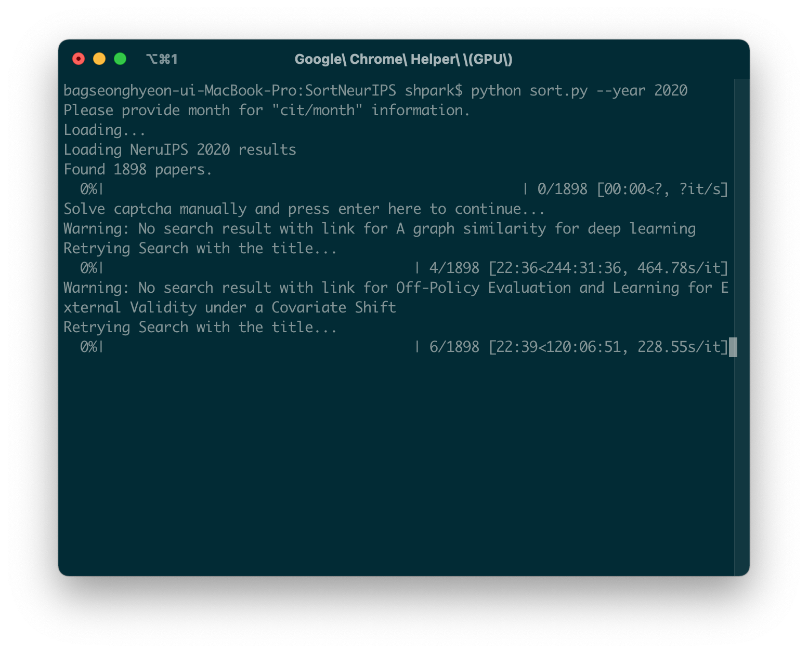
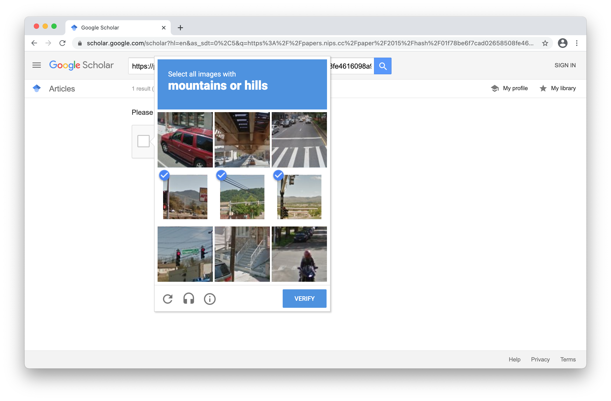
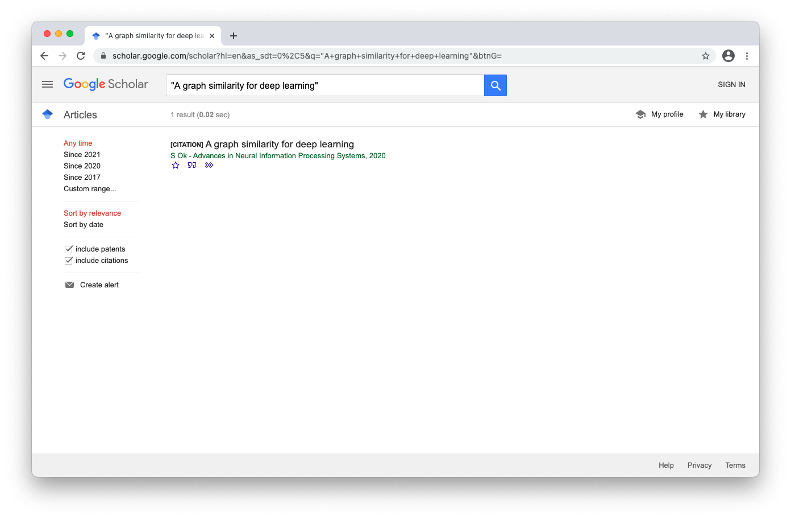
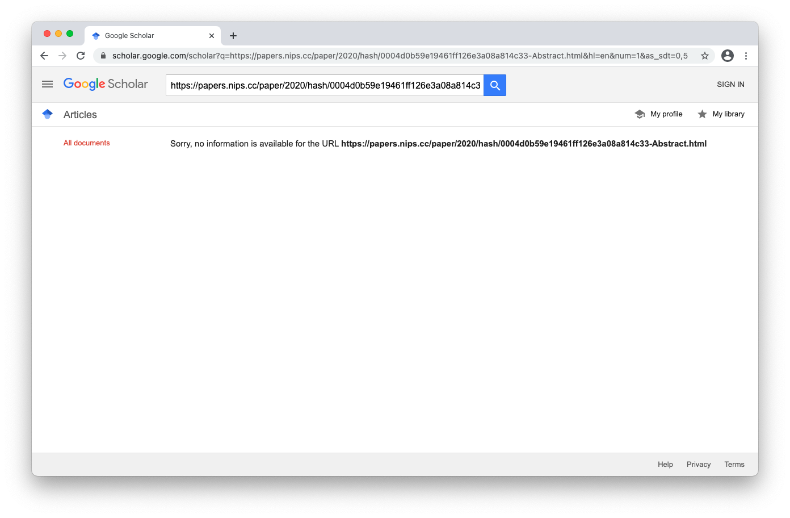
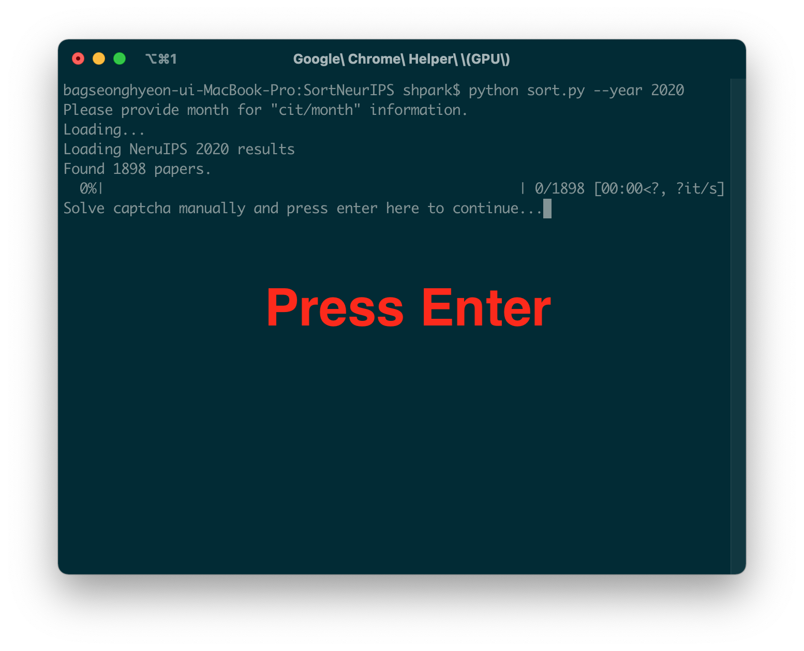
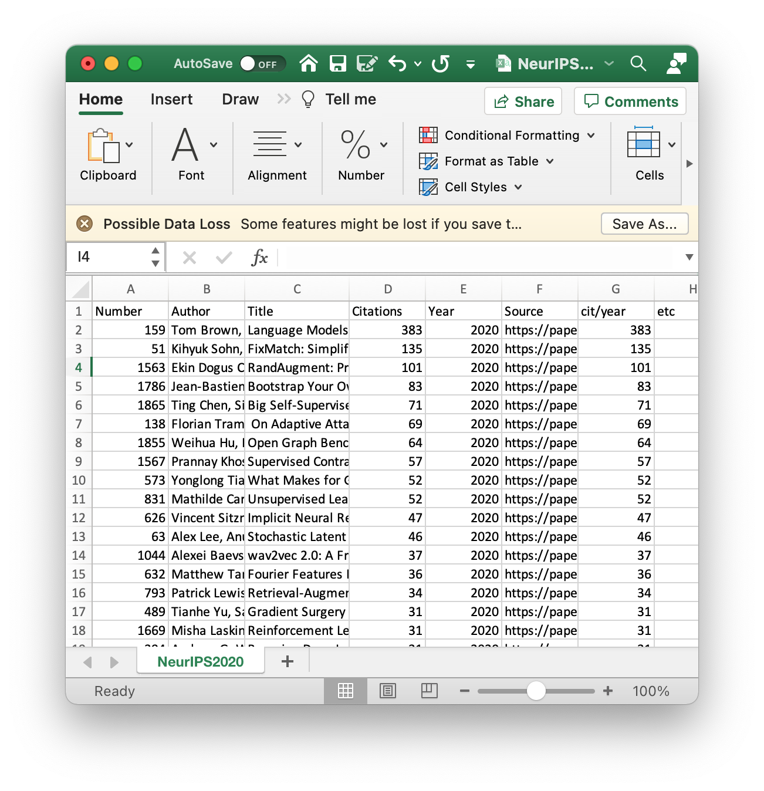
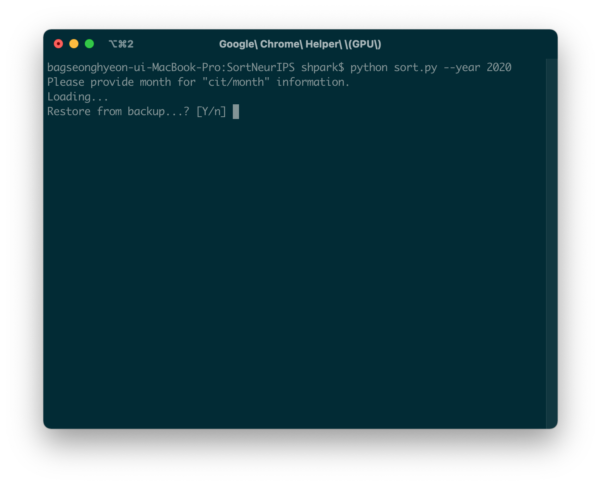

# Sort My Conference
Sort [NeurIPS](https://nips.cc/), [ICML](https://icml.cc/), [ICLR](https://iclr.cc/), [CVPR](https://openaccess.thecvf.com/menu), [ICCV](https://openaccess.thecvf.com/menu), [ECCV](https://link.springer.com/conference/eccv) 
 papers by the number of citations.

# Description
SortMyConf generates a sorted list of papers at an AI/ML top-tier conference. It automatically searches each paper in the proceedings on Google Scholar and captures the number of citations. Codes are developed for internal usage at [SPA Laboratory](https://www.spa.hanyang.ac.kr/); use at your own risk.

# Usage

## Environment Setup
First, you need a Python 3 environment to run this program. Once you have the environment on your system, install the following dependencies: beautifulsoup4, pandas, selenium, tqdm.
```
pip install -r requirements.txt
```

## Run
The program accepts the following arguments.

```
"--conference" (required): The conference name to sort papers in its proceedings. Supports NeurIPS, ICML, ICLR, CVPR, ICCV and ECCV.

"--year" (required): The conference year.

"--month" (optional): The conference month. Used for calculating average citations per month.

"--csv (optional)": The location to save output *.csv file.
```

A basic usage is as follows. As an example, we will sort NeurIPS 2020 papers and output NeurIPS2020.csv.

```
python run.py --conference=NeurIPS --year=2020
```

It may take several seconds till the program collect a list of titles, authors and proceedings link for the papers to sort.

A Chrome (controlled by Selenium driver) window will open, and the program will automatically search each paper in the list and record its number of citations (See descriptions below if Google Scholar asks if you are not a robot).

<p align="center"></p>

Google Scholar may ask you to solve the Captcha to prove that you are not a robot. Solve it until you see the search results. It is fine even if you get an empty results page.

<p align="center"></p>
<p align="center">Solve the Captcha problems</p>

<p align="center"></p>
<p align="center">Search Results (Good)</p>

<p align="center"></p>
<p align="center">Empty Results (Still good)</p>

Once you get here, press ENTER on your terminal. The program will continue working. Note that you are likely to be asked to solve captcha multiple times while the program is working. Repeat the procedures so far whenever you are asked.

<p align="center"></p>

When finished, the program will output NeurIPS2020.csv at the current directory. The csv file will include paper ids, paper names, authors, citations (and yearly averages), sources. Papers are sorted in descending order.

<p align="center"></p>

Optinally, you can add "--month" argument to calculate the number of citations per month. It is useful when the event happend within the past few months. NeurIPS is usally held on December.

```
python run.py --conference=NeurIPS --year=2020 --month=12
```

You can also add "--csv" argument to set alternative location to save the output csv file.

```
python run.py --conference=NeurIPS --year=2020 --month=12 --csv="PATH_TO_THE_DIRECTORY"
```

The program can restore from backup ("./temp/backup.pkl") saved while working. If the program is terminated for any reason just answer "Y" to the question upon the program's startup.

<p align="center"></p>